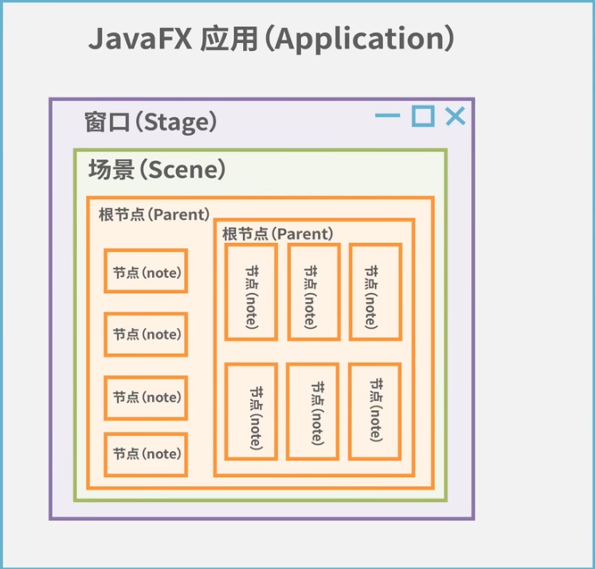

# Easy-Diary
提升: 复盘 + 制定计划

- 目标 = 理想 + 截止日期
- 想要变强就要做一个`清晰`的人

Aimed for help you `look back on yourself`.

## Main page (display data)

That is inspired by this web application: https://codestats.net! We encourage programmers can use it!
- 制作一个如图所示的年历来展示用户这一整年的使用laptop的学习情况
> A Calendar to track the whole year usage of "learning mode" of user.
- 系统获取当前年月日信息，当用户点击年历里面的项时判断：
  - 如果是过去（昨天以及之前）：调出一个panel来回顾那些使用learning mode产生的数据。
  - 如果是现在（今天）：调出一个panel来观察今天使用learning mode产生的数据。
  - 如果是未来（明天以及之后）：调出一个panel让用户在这个panel里面可以写下对那一天的计划规划。

### JavaFX for GUI dev

## Learning mode (collect data)
用户在开启`learning mode`之前先让他输入一个`关键词`来确定他在做什么工作，便于后续数据管理。

- **Excerpt**: 当按下 Ctrl+C，选中的句子会被摘录下来。
  - `StringClip.java`: You can learn how to use `Toolkit` and `Clipboard`.
- **Thought**: 当按下 Ctrl+K，将会快速调出一个panel供用户快速记录下此刻感想。
  - `QuickNoteApp.java`: You can learn how to use `Swing` and `Singleton mode`.

### Local storage scheme
> 在 Maven 项目中，resources 文件夹用于存放所有 非 Java 代码的资源文件，如配置文件、静态资源、文本文件、图片等。

version 0 for `.txt` file storage, I just focus on the core logic development.

Later on, when I have some collaboration friends, let us add `database` something else!
`year_month_day` hierarchy:
- `year` and `month` are both directory.
- `day` is the data file.

## LLM API
你需要在resource文件下新建一个`api_key.txt`文件来存储你的deepseek的api启用LLM的调用。
How to revoke the api of deepseek or openai.

ATTENTION!!! If you post request via HTTP, you should do encoding with `UTF-8` for chinese words.

## Let AI help you organize what you learn today.
TODO:
1. First stage: text, users' excerpts and thoughts.
2. Second stage: image users uploaded. such as some do-wrong question.

## Question learning method
When you input one or several paragraph (which can be called `knowledge`), we will let AI generate some questions based that `knowledge`.

In this way, you can answer these questions to enhance your understanding.  

Cruel Mode: If your answer is not so good (`how to quantify the quantity of the answer.`), we wouldn't let you continue (`so how?`).

## Shadowing method for english learning
User can input `sentences`, then we will help you transform `text` into `audio` for you to shadowing-ly read.

### TTSs I tried in 2025.02.08
- Java Maven can configure `FreeTTS` and `MaryTTS`, but I had not fetched the `chinese language support`.

- Morilla TTS
  - pip install TTS, then, input model file (.pth file) and configuration file (.json file). However, something wrong!
  - git clone TTS source code, but pip install -e . this step, I met some issues.

- gTTS: some network issue, I guess the reason behind lies in the package issue. 我在下载`gTTS`的时候，就报错啦，要求 requests==2.25.1 以及 numpy==1.21.5。
>这种冲突有时可能不会立即导致错误，但可能在使用 d2l 或与其相关的功能时引发一些意外问题，尤其是 requests 和 numpy 这两个包是很多机器学习和数据处理任务的基础。
如果您正在使用 d2l 和 gTTS，这些依赖冲突可能会影响到您运行代码的稳定性和功能，特别是在涉及网络请求和数据处理时。

- pyttsx3: Successful!
  - Use python to serve as `server`.
  - `uvicorn voice:app --reload` (`uvicorn <pyfilename>:app --reload --host 0.0.0.0 --port 8001`)
  - .java sends the request.
  
  但有一说一，这个发音很机械化啊。。还得找别的解决方案

### for oral training 