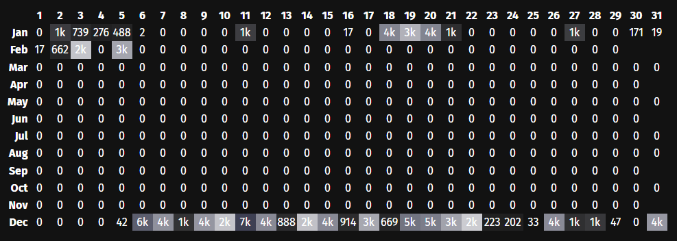
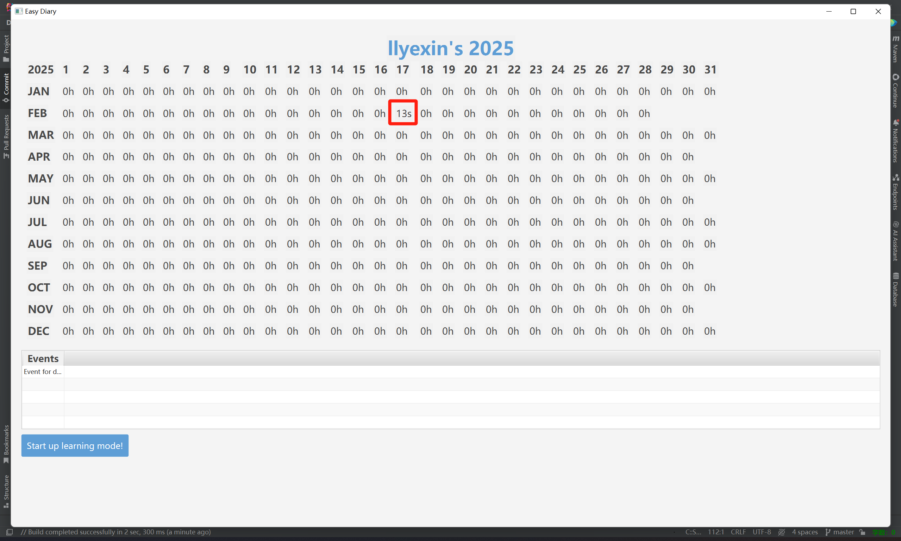
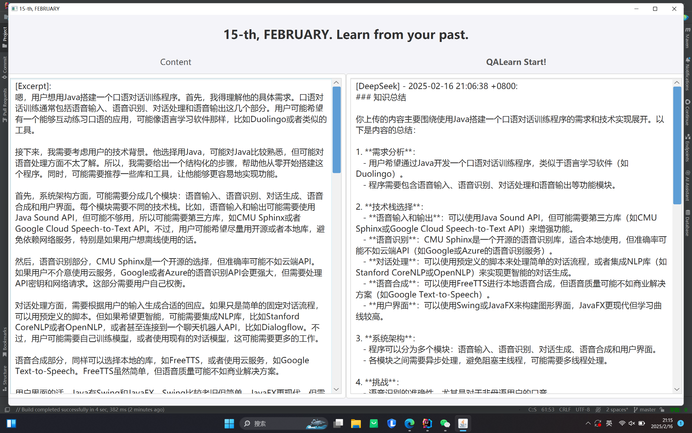
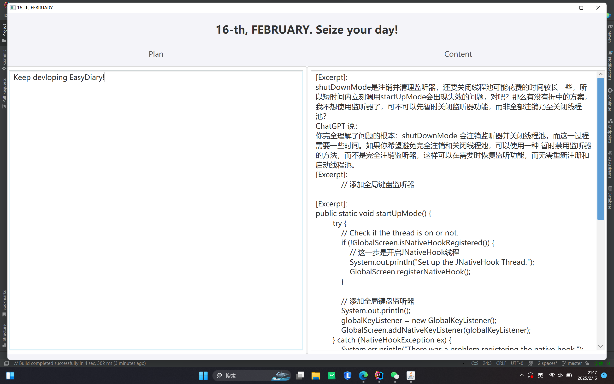
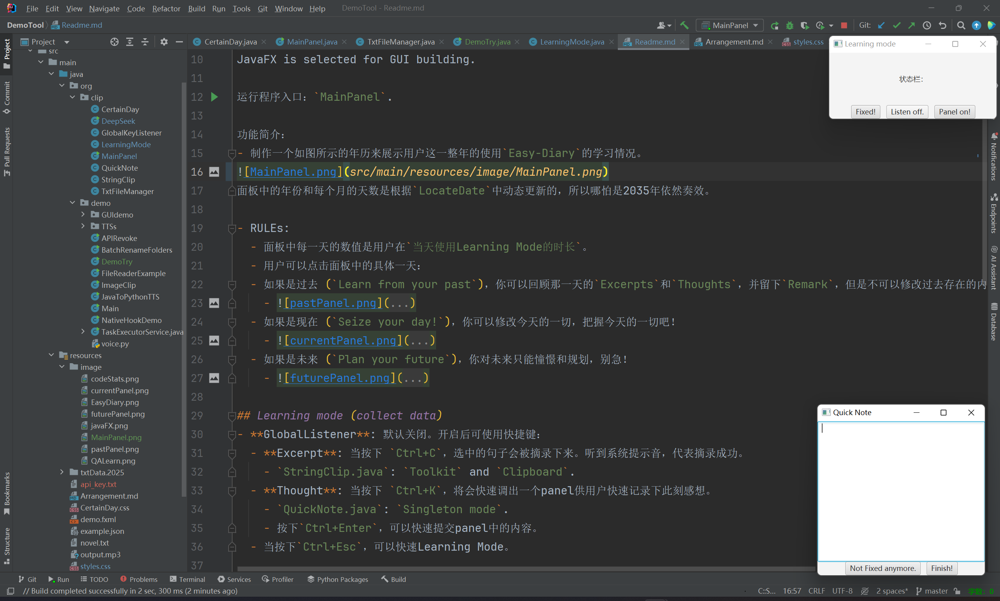
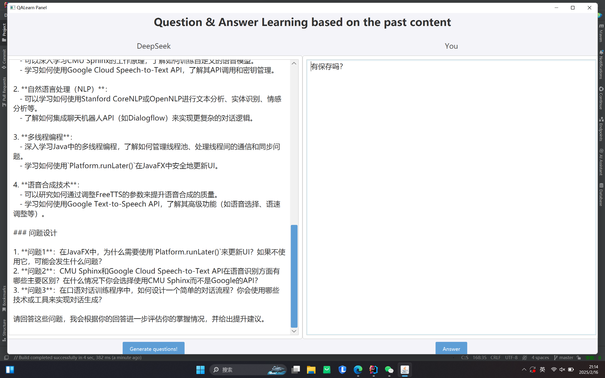

# Easy-Diary

## Motivation

不知道是不是很多人和我一样，明白我们永远不会比此刻更年轻，所以总想记录下些什么以便未来的自己朝花夕拾。可是我总是坚持不下来，日记写一阵子就断更，似乎是魔咒。

`EasyDiary`的初衷就是根据我们使用laptop学习产生的数据，让AI帮我们写一份日记初稿。这样，只要我们`keep learning`，在不经意间就日记就写好啦！

此外，我还希望通过`EasyDiary`来让自己更清楚自己的一天。正如那句“你怎样度过一天，就会怎样度过一生”。因此，在`EasyDiary`，我会探索如何更好的做好时间规划，拓宽生命的厚度！
> 24h oneday = 8h sleep + 3h eat and rest + 1h exercise + 12h free allocation (Learning or entertainment)

## Main page (display data)

> The display of MainPanel is inspired by this web application: https://codestats.net! I also encourage programmers to use it!
> 

JavaFX is selected for GUI building.

运行程序入口：`MainPanel`.

功能简介：
- 制作一个如图所示的年历来展示用户这一整年的使用`Easy-Diary`的学习情况。
  - 面板中的年份和每个月的天数是根据`LocateDate`动态更新的，所以哪怕是2035年依然奏效。

- RULEs:
  - 面板中每一天的数值是用户在`当天使用Learning Mode的时长`。
    - 
  - 用户可以点击面板中的具体一天：
  - 如果是`过去` (`Learn from your past`)，你可以回顾那一天的`Excerpts`和`Thoughts`，并留下`Remark`，但是不可以修改过去存在的内容。
    - 
  - 如果是`现在` (`Seize your day!`)，你可以修改今天的一切，把握今天的一切吧！
    - 
  - 如果是`未来` (`Plan your future`)，你对未来只能憧憬和规划，别急！
    - 

## Learning mode (collect data)
打开`学习模式`后，会默认隐藏`主面板`；退出`学习模式`后，会自动调出隐藏的`主面板`。

- **GlobalListener**: 默认关闭 (状态栏第二项：`Listen off`.)。点击`Listen off`可开启按键监听模式，可使用快捷键：
  - 当按下 `Ctrl+C`，选中的句子会被摘录下来。听到系统提示音，代表摘录成功。 **[Excerpt] - timestamp**
    - `StringClip.java`: `Toolkit` and `Clipboard`.
  - 当按下 `Ctrl+K`，将会快速调出一个panel供用户快速记录下此刻感想。**[Thought] - timestamp**
    - `QuickNote.java`: `Singleton mode`.
    - 按下`Ctrl+Enter`，可以快速提交panel中的内容。听到系统提示音，代表成功。
    - 当按下`Ctrl+方向键`，可以按照你的意愿自由移动`QuickNotePanel`的位置。
  - 当按下`Ctrl+Esc`，可以快速推出`Learning Mode`。听到系统提示音，代表成功。
- **ActiveWindowTracker**: 捕捉用户在使用`learningMode`时，`focus`在`App`上的总时间；以及`窗口切换链`。
- **FaceExpressionAnalyser**: 分析用户在使用`learningMode`面部表情，从而推断用户的心情，为AI日记做BackUp。（待开发）

### Local storage scheme
> 在 Maven 项目中，resources 文件夹用于存放所有 非 Java 代码的资源文件，如配置文件、静态资源、文本文件、图片等。

version 0 for `.txt` file storage, I just focus on the core logic development.

`year_month_day_type` hierarchy:
- `year`, `month` and `day` are both directories.
- `type` is data txt file.

Later on, when I have some collaboration friends, let us add `database` connection!
> What is the core of database?

## Question learning method

When you input one or several paragraph (which can be called `knowledge`), we will let AI generate some questions based that `knowledge`.

In this way, you can answer these questions to enhance your understanding.  

> TODO: Cruel Mode: If your answer is not so good (`how to quantify the quantity of the answer.`), we wouldn't let you continue (`so how?`).

## Future work: Shadowing method for english learning
User can input `sentences`, then we will help you transform `text` into `audio` for you to shadowing-ly read.

### TTSs I tried in 2025.02.08
- Java Maven can configure `FreeTTS` and `MaryTTS`, but I had not fetched the `chinese language support`.

- Morilla TTS
  - pip install TTS, then, input model file (.pth file) and configuration file (.json file). However, something wrong!
  - git clone TTS source code, but pip install -e . this step, I met some issues.

- gTTS: some network issue, I guess the reason behind lies in the package issue. 我在下载`gTTS`的时候，就报错啦，要求 requests==2.25.1 以及 numpy==1.21.5。
>这种冲突有时可能不会立即导致错误，但可能在使用 d2l 或与其相关的功能时引发一些意外问题，尤其是 requests 和 numpy 这两个包是很多机器学习和数据处理任务的基础。
如果您正在使用 d2l 和 gTTS，这些依赖冲突可能会影响到您运行代码的稳定性和功能，特别是在涉及网络请求和数据处理时。

- pyttsx3: Successful!
  - Use python to serve as `server`.
  - `uvicorn voice:app --reload` (`uvicorn <pyfilename>:app --reload --host 0.0.0.0 --port 8001`)
  - .java sends the request.
  
  但有一说一，这个发音很机械化啊。。还得找别的解决方案

### for oral conversion training 